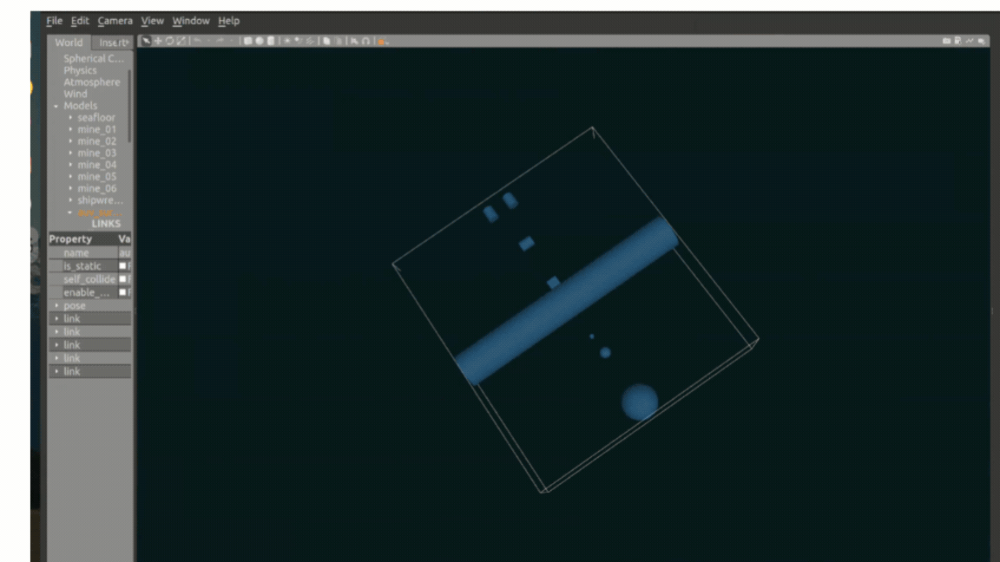

# 🌊 AUV Mine Surveillance — Autonomous Underwater Vehicle Simulation

**A ROS2 + Gazebo simulation of a 4-thruster torpedo-style AUV that fuses IMU, DVL and sonar data to autonomously survey a minefield, localize threats, and log missions.**


<p align="center">
  
</p>

---

## Overview

This project simulates an autonomous underwater vehicle (AUV) tasked with surveying a seafloor minefield and flagging potential threats in real time — the kind of pipeline used in naval mine-countermeasure (MCM) systems. Everything runs in a fully simulated ROS2 + Gazebo Classic environment, from thruster-level control up to EKF-fused localization, SLAM Toolbox mapping, and automated mission logging.

Built as part of my B.Tech Automation & Robotics coursework and IIT Mandi research internship, this is the underwater counterpart to my land-based SLAM/Nav2 work — applying the same sensor-fusion and autonomy principles to a 6-DOF, unstructured, GPS-denied environment.

## Key Features

- **6-DOF AUV model** — torpedo-hull URDF/Xacro with 4 independently-controlled thrusters (port surge, starboard surge, heave, yaw)
- **Multi-sensor simulation** — 50 Hz IMU, 4-beam Doppler Velocity Log (DVL) for underwater odometry, pressure/depth sensor, and a 120° FOV forward-looking sonar (30 m range) for mine detection
- **EKF sensor fusion** — `robot_localization` fuses IMU + DVL twist estimates into a smooth, drift-corrected pose estimate (no GPS underwater)
- **SLAM Toolbox mapping** — builds an occupancy-grid map of the minefield from sonar returns as the AUV explores
- **Autonomous mission logging** — a dedicated node compares live pose against sonar detections, classifies objects as `SAFE`/threat, and streams every contact to a timestamped CSV mission log (a [sample run](results/sample_mission_log.csv) is included)
- **Manual + programmatic control** — keyboard teleop node for quick testing, plus a `cmd_vel`-driven thruster mixer for waypoint/autonomous control

## Architecture

```
                     ┌──────────────────────┐
   /auv/imu/data ───▶│                      │
   /auv/dvl/ranges──▶│  Localization Node   │──▶ /auv/dvl/twist ──┐
                     │  (IMU + DVL fusion)  │                    │
                     └──────────────────────┘                    ▼
                                                       ┌────────────────────┐
   /auv/depth_sensor ───────────────────────────────▶ │   EKF (robot_       │──▶ /auv/odom ──┐
                                                       │   localization)      │               │
                                                       └────────────────────┘               │
                                                                                              ▼
   /auv/sonar/scan ───────────────────────────────▶ ┌──────────────────┐        ┌────────────────────┐
                                                     │  SLAM Toolbox     │        │  Mission Logger     │
                                                     │  (occupancy map)  │        │  (mine detection +  │
                                                     └──────────────────┘        │  CSV logging)       │
                                                                                  └────────────────────┘
   /cmd_vel ──▶ Thruster Controller ──▶ 4× thruster force topics ──▶ Gazebo AUV model
```

## Tech Stack

| Layer | Tools |
|---|---|
| Middleware | ROS2 Humble |
| Simulation | Gazebo Classic |
| Sensor fusion | `robot_localization` (EKF) |
| Mapping | SLAM Toolbox |
| Robot description | URDF / Xacro |
| Language | Python 3 (`rclpy`), C++ build via `ament_cmake` |
| Logging / analysis | Python `csv`, NumPy |

## Repository Structure

```
├── src/auv_mine_surveillance/
│   ├── nodes/
│   │   ├── auv_localization_node.py   # DVL + IMU → twist for EKF
│   │   ├── auv_thruster_controller.py # cmd_vel → 4-thruster force mixer
│   │   ├── auv_mission_logger.py      # sonar contacts → CSV mission log
│   │   └── auv_teleop.py              # keyboard teleop (WASD/QE)
│   ├── urdf/auv_surveillance.urdf.xacro
│   ├── worlds/minefield.world         # seafloor + 6 mine models
│   ├── config/ekf_config.yaml
│   ├── config/slam_toolbox_config.yaml
│   └── launch/auv_simulation.launch.py
├── results/sample_mission_log.csv     # sample logged run
└── assets/demo.gif
```

## Getting Started

**Prerequisites:** Ubuntu 22.04, ROS2 Humble, Gazebo Classic, and the following ROS packages:
`gazebo_ros`, `gazebo_plugins`, `robot_localization`, `slam_toolbox`, `xacro`, `robot_state_publisher`, `joint_state_publisher`.

```bash
# 1. Clone into a colcon workspace
mkdir -p ~/auv_ws/src && cd ~/auv_ws/src
git clone https://github.com/<your-username>/auv-mine-surveillance.git .

# 2. Install dependencies & build
cd ~/auv_ws
rosdep install --from-paths src --ignore-src -r -y
colcon build --symlink-install
source install/setup.bash

# 3. Launch the full simulation
ros2 launch auv_mine_surveillance auv_simulation.launch.py
```

**Useful launch arguments:**

| Argument | Default | Description |
|---|---|---|
| `use_gui` | `true` | Show Gazebo GUI |
| `enable_slam` | `true` | Run SLAM Toolbox mapping |
| `enable_logger` | `true` | Run the mission logger |
| `spawn_x/y/z` | `0.0 / 0.0 / -20.0` | AUV spawn pose |

Drive manually with:
```bash
ros2 run auv_mine_surveillance auv_teleop.py
```

## Results

A [sample mission log](results/sample_mission_log.csv) is included, recording AUV pose, sonar range/bearing, and mine-contact classifications throughout a full survey run of the 6-mine field defined in `minefield.world`.

## Roadmap

- [ ] Replace fixed mine-detection radius with a probabilistic classifier on sonar returns
- [ ] Add waypoint-following mission planner (currently teleop / `cmd_vel` driven)
- [ ] Port sensor models to a physically-accurate underwater sonar plugin

## Author

**Lucky Bisht** — B.Tech Automation & Robotics, GGSIPU Delhi
Embedded/SLAM Intern @ Navyug Infosolutions · [LinkedIn](https://www.linkedin.com/in/lucky-bisht-b176b2291/) · [GitHub](https://github.com/luckybisht21)

## License

MIT — see [LICENSE](LICENSE).
